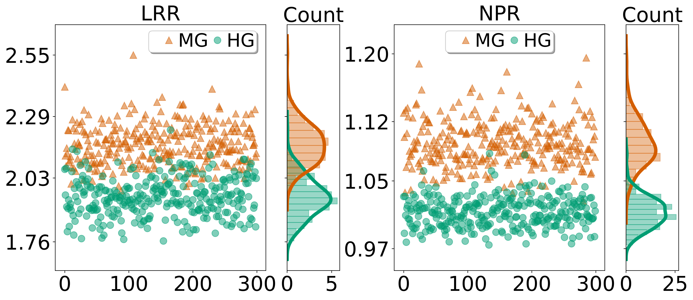
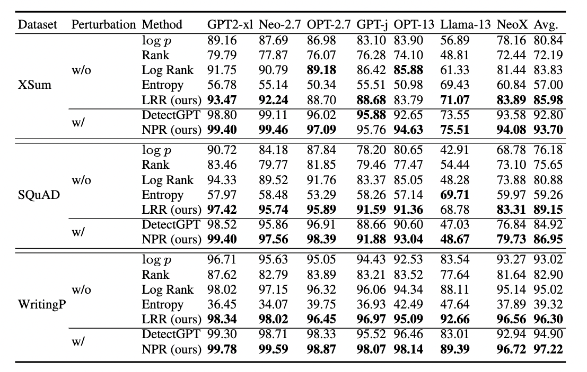
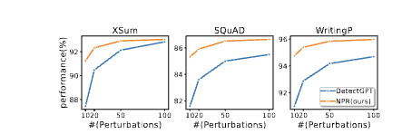
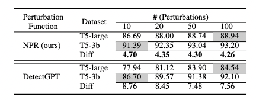
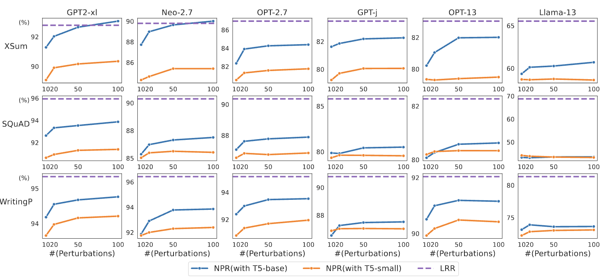

# DetectLLM: Leveraging Log Rank Information for Zero-Shot Detection of Machine-Generated Text

##### [Jinyan Su](https://jinyansu1.github.io/), [Terry Yue Zhuo](https://terryyz.github.io/), [Di Wang](https://shao3wangdi.github.io/), [Preslav Nakov](https://mbzuai.ac.ae/study/faculty/preslav-nakov/)

#### [ArXiv](https://arxiv.org/pdf/2306.05540.pdf) | [Github](https://github.com/mbzuai-nlp/DetectLLM) 

## Abstract

With the rapid progress of large language models (LLMs) and the huge amount of text they generated, it becomes more and more impractical to manually distinguish whether a text is machine-generated. Given the growing use of LLMs in social media and education, it prompts us to develop methods to detect machine-generated text, preventing malicious usage such as plagiarism, misinformation, and propaganda. Previous work has studied several zero-shot methods, which require no training data. These methods achieve good performance, but there is still a lot of room for improvement. In this paper, we introduce two novel zero-shot methods for detecting machine-generated text by leveraging the log rank information. One is called DetectLLM-LRR, which is fast and efficient, and the other is called DetectLLM-NPR, which is more accurate, but slower due to the need for perturbations. Our experiments on three datasets and seven language models show that our proposed methods improve over the state of the art by 3.9 and 1.75 AUROC points absolute. Moreover, DetectLLM-NPR needs fewer perturbations than previous work to achieve the same level of performance, which makes it more practical for real-world use. We also investigate the efficiency — performance trade-off based on users preference on these two measures and we provide intuition for using them in practice effectively.

## Motivation

Log-Likelihood Log-Rank Ratio(LRR) and Normalized Log-Rank Perturbation(NPR) are both distinguishable features for classifying machine generated text and human generated texts. LRR is faster to compute and thus more efficient, but NPR achieves better performance.

<p align="center">
  
</p>

## Baselines zero-shot methods

<table>
<thead>
  <tr>
    <th>Baseline zero-shot method</th>
    <th >Description</th>
  </tr>
</thead>
<tbody>
  <tr>
    <td>$\log p(x)$</td>
    <td>a passage with a high average log probability is more likely to have been generated by the target LLM</td>
  </tr>
   <tr>
        <td>Rank</td>
        <td>a passage with a higher average rank is more likely to have been generated by the target LLM</td>
  </tr>
    <tr>
    <td>Log-Rank</td>
    <td>passage with higher average observed log rank is more likely to have been generated by the target LLM</td>
  </tr>
  <tr>
    <td>Entropy</td>
    <td>machine-generated text has higher entropy</td>
  </tr>
  <tr>
    <td>DetectGPT</td>
    <td>machine-generated text has more negative log probability curvature.</td>
  </tr>
   <tr>
    <td>LLR(ours)</td>
    <td>LLR is generally larger for machine-generated text, which can be used for distinguishing machine-generated from human-written text.</td>
  </tr>
   <tr>
    <td>NPR(ours)</td>
    <td>machine-generated and human-written texts are both negatively affected by small perturbations, i.e., the log rank score will increase after perturbations, but machine-generated text is more susceptible to perturbations and thus increasing more on log rank score after perturbation, which suggests higher NPR score for machine-generated texts.</td>
  </tr>
  <tr>

## LLMs used in our experiments:

<table>
<thead>
  <tr>
    <th>LLMs</th>
    <th >hugging face Link</th>
  </tr>
</thead>
<tbody>
  <tr>
    <td>GPT2-xl</td>
   <td><a href="https://huggingface.co/gpt2-xl" target="_blank" rel="noopener noreferrer">Link</a></td>
  </tr>
   <tr>
        <td>GPT-Neo-2.7B</td>
       <td><a href="https://huggingface.co/EleutherAI/gpt-neo-2.7B" target="_blank" rel="noopener noreferrer">Link</a></td>
  </tr>
    <tr>
    <td>OPT-2.7B</td>
   <td><a href="https://huggingface.co/facebook/opt-2.7b" target="_blank" rel="noopener noreferrer">Link</a></td>
  </tr>
  <tr>
    <td>OPT-13B</td>
   <td><a href="https://huggingface.co/facebook/opt-13b" target="_blank" rel="noopener noreferrer">Link</a></td>
  </tr>
  <tr>
    <td>GPT-j-6B</td>
  <td><a href="https://huggingface.co/EleutherAI/gpt-j-6b" target="_blank" rel="noopener noreferrer">Link</a></td>
  </tr>
  <tr>
    <td>Llama-13b</td>
   <td><a href="https://huggingface.co/decapoda-research/llama-13b-hf" target="_blank" rel="noopener noreferrer">Link</a></td>
  </tr>
   <tr>
    <td>NeoX-20B</td>
   <td><a href="https://huggingface.co/EleutherAI/gpt-neox-20b" target="_blank" rel="noopener noreferrer">Link</a></td>
  </tr>
</tbody>
</table>

## Main result

Since perturbation based methods (DetectGPT, NPR(ous)) have a more superior performance, (but 50-100 times slower), for fair comparision, we compare perturabtion based methods and perturbation free methods($\log p(x)$, rank, log rank, ) respectively.

<p align="center">
  
</p>

## Compare NPR to DetectGPT

### Different Number of Perturbations.

<p align="center">
  
</p>

### Different Perturbation Functions

<p align="center">
  
</p>

### Different temperature

<p align="center">
  
</p>

## Efficiency analysis

### Computational time
Computational time (seconds) for different zero-shot methods on different LLMs (averaged over 10 reruns)
<p align="center">
  
</p>


### Strategy of which zero-shot method to choose
- T5-small and T5-base are not good candidates 538
for perturbation functions.

using T5-base and T5-small performs worse than LRR even with 50 to 100 perturbations, which suggests that LRR can be at least 50 to 100 times faster while outperform perturbation based methods. So, if the user can only afford T5-small or T5-base as perturbation function, they should choose LRR with no hesitation since it achieves both better efficiency and better performance.

<p align="center">
  
</p>

- Cost-Effectiveness on More Perturbations and Larger Perturbation Function.


(1) To achieve the same performance as LRR, generally we only need less than 10 perturbations using T5-3b as perturbation function. This estimate could help us choose whether to use NPR or LRR on validation set: setting the number of perturbation to be 10, if LRR outperforms NPR, we would suggest use LRR, otherwise, NPR would be a better option.

(2) To achieve the same performance, using T5-large takes more than 2 times perturbations than using T5-3b, while the perturbation time using T5-3b is less than twice of the time using T5-large, so using large perturbation functions such as T5-3b is much more efficient than using smaller ones such as T5-large. The only concern is the memory. 

<p align="center">
  
</p>


## Create environment and run experiments

The data would be genrated while running `main.py`. We use three datasets: XSum, SQuAD, WritingPrompts, containing news articles, Wikipedia paragraphs and prompted stories, respectively.

```
conda create --name DetectLLM python=3.8 
conda activate DetectLLM
pip install -r requirements.txt

bash run.sh # run bash file
```

## Acknowledgements

- [DetectGPT](https://detectgpt.ericmitchell.ai/)

## Citation

Please cite us if you use our data or models.

```bibtex
@article{su2023detectllm,
  title={DetectLLM: Leveraging Log Rank Information for Zero-Shot Detection of Machine-Generated Text},
  author={Su, Jinyan and Zhuo, Terry Yue and Wang, Di and Nakov, Preslav},
  journal={arXiv preprint arXiv:2306.05540},
  year={2023}
}
```
